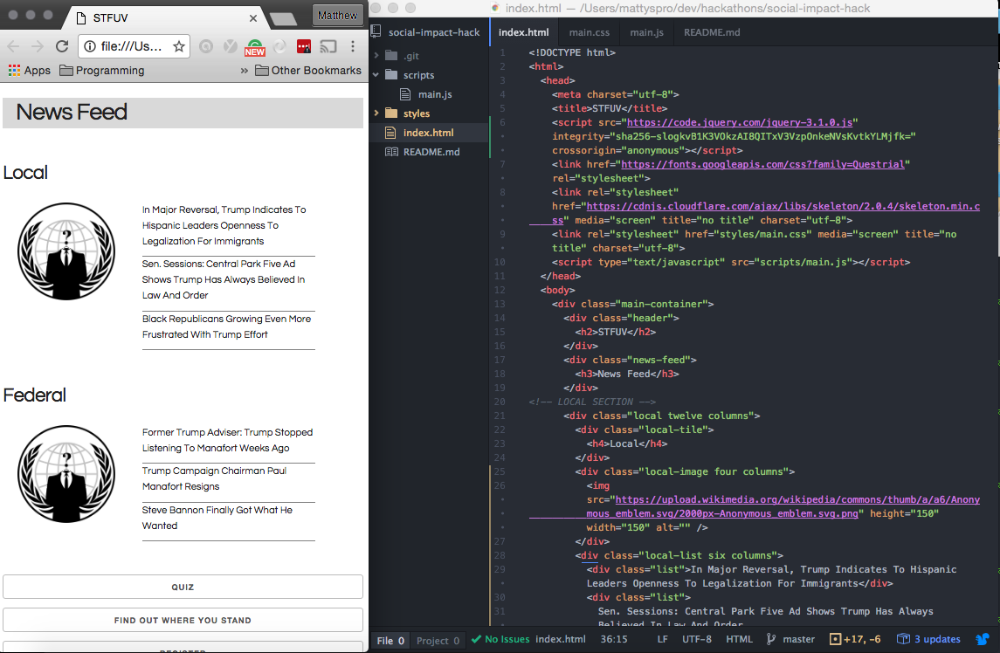
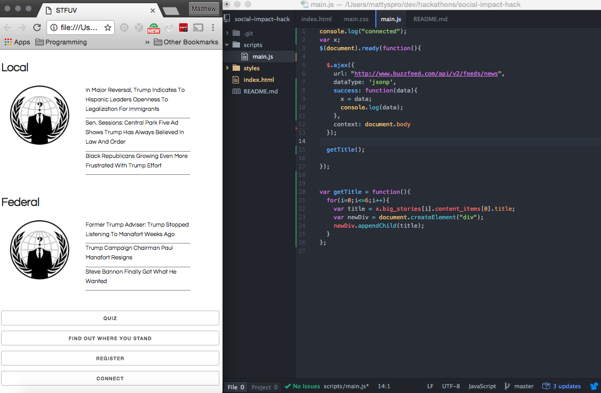

# Social-Impact-Hackthon

### Shut The F*** Up and Vote

Goal: The Goal of this Hackathon was to create an app that motivates young voters to go out and vote.

Contributors:
Scott Maloff (UX Designer)
Jenn Scheller (UX Designer)
Benjamin Yang (Full Stack Developer)
Matt Laguardia (Full Stack Developer)

Presentation Deck: https://docs.google.com/presentation/d/1XDyd9DSr15sgvIh9hT07QoedMMjxW7w9DoCgiNaXxpQ/edit#slide=id.p

### Time
This project was created in about a 3 hour span

## Images

